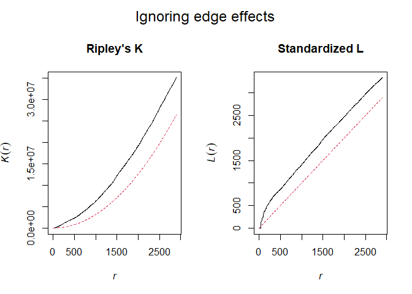

Spatial Dispersion and Point Data Analysis
================
Cliff
2023-03-04

**Reference and Disclaimer:** For this exercise, I have used explanation
and major chunk of codes from the book ***Spatial Ecology and
Conservation Modeling*** by ***Robert Fletcher & Marie-Josée Fortin***.

### Spatial point pattern analysis

Point data provides important information about the spatial patterns of
the species. It helps understanding variety of ecological processes such
as species territory and social behavior. Spatial point pattern analysis
focuses on examining the pattern of points to understand their
distribution process - if they are clustered, randomly spread or evenly
distributed and also the scales at which the pattern occurs.

Load the necessary packages required for the spatial point pattern
analysis

Import the required point data(vernal pools).

``` r
vp.sites = readOGR("D:/UGA/Academic Course Work/Fall-2022/FANR-8400-AdvGIS/Assignments/Ex2/SpaStatAssign/SpaStatData.gdb","vernal_pools")
```

Summary of the Spatial point pattern of the vernal pools

``` r
summary(vp.sites)
```

    ## Object of class SpatialPointsDataFrame
    ## Coordinates:
    ##                min      max
    ## coords.x1 107593.3 121687.4
    ## coords.x2 885957.0 895552.6
    ## Is projected: TRUE 
    ## proj4string :
    ## [+proj=lcc +lat_0=41 +lon_0=-71.5 +lat_1=42.6833333333333
    ## +lat_2=41.7166666666667 +x_0=200000 +y_0=750000 +datum=NAD83 +units=m
    ## +no_defs]
    ## Number of points: 225
    ## Data attributes:
    ##    Pvp_number     X_coord          Y_coord      
    ##  Min.   :  1   Min.   :107593   Min.   :885957  
    ##  1st Qu.: 57   1st Qu.:112957   1st Qu.:888600  
    ##  Median :113   Median :115493   Median :891114  
    ##  Mean   :113   Mean   :115217   Mean   :891004  
    ##  3rd Qu.:169   3rd Qu.:118649   3rd Qu.:893747  
    ##  Max.   :225   Max.   :121687   Max.   :895553

We have 225 data points with specified projection.

Creating spatstat object to delineate the window size

``` r
# crop the sites layer to 1 km from sampling points
x.min <- min(vp.sites$X_coord) - 1000
x.max <- max(vp.sites$X_coord) + 1000
y.min <- min(vp.sites$Y_coord) - 1000
y.max <- max(vp.sites$Y_coord) + 1000

ppp.window <- owin(xrange=c(x.min, x.max),yrange=c(y.min, y.max))
ppp.vp <- ppp(vp.sites$X_coord, vp.sites$Y_coord, window=ppp.window)
```

### First-order statistics

It focuses on summarizing point data based individual points without
focusing on the relation with adjacent points and inter-point
information.

``` r
par(mfrow = c(1, 2),oma = c(0, 0, 2, 0))
Q <- quadratcount(ppp.vp, nx = 4, ny = 4)#counts in 12.5x12.5m quadrats
plot(ppp.vp, main="Simple point plot") # graph of point locations
plot(ppp.vp, cex=1, main="Quadrats count plot") #point count based on quardrats overlaid on the plot
plot(Q, add = TRUE, cex = 1)
mtext("Point plots",   # Add main title
      outer = TRUE,
      cex=1.5)
```

<!-- -->

We use **Density plots** to visualize the intensity of points across the
plot to get an idea of whether or not there may be spatial trends in the
point occurrences that may violate the assumption of a homogeneous point
process.

``` r
plot(density(ppp.vp), main="Density Plot")
```

<!-- -->

### Second-order point pattern analysis

It focuses on statistical relationships derived from information
contained in the adjacent points. It takes into consideration the
inter-point information to interpret point patterns. The approach
includes and not limited to measuring the degree of spatial aggregation
between neighboring points within a circular area of radius say $r$. The
best known and commonly used ia Ripley’s K function.

**Ripley’s K (and L)** - Calculates the degree of spatial aggregation of
points within a circle of radius r and contrasts the observed pattern to
that expected under Complete Spatial Randomness(CSR,i.e., a homogeneous
Poisson Process). $$K(r) = E/\lambda,$$ where $\lambda = n/A$ and $E =$
number of points within radius $r$ of an arbitrary chosen point (not
including that point). $$K(r)_{CSR} = E_{CSR}/\lambda$$ and
$$E_{CSR}=\lambda\pi r^2.$$ If $K(r) > K(r)_{CSR}$, the observed number
of events shows the evidence of clustering, whereas if
$K(r) < K(r)_{CSR}$, the observed number of events shows the evidence of
regularity. $E_{CSR}$ results in exponential increase due to $r^2$,
which has undesirable properties, hence improved linearized function
**Ripley’s L** is used. $$\hat{L(r)} = \sqrt(K(r)/\pi) = r$$

``` r
par(mfrow = c(1, 2),oma = c(0, 0, 2, 0))
Knone <- Kest(ppp.vp, correction="none")
plot(Knone, legend=F, main="Ripley's K")

Lnone <- Lest(ppp.vp, correction="none")
plot(Lnone, legend=F, main="Standardized L")#standardized to 1:1 expectation

mtext("Ignoring edge effects",   # Add main title
      outer = TRUE,
      cex=1.5)
```

<!-- -->

The observed Ripley’s K and L plot appears different from one another.
We have to investigate further if the point patter follows CSR. But
before that lets add edge correction to the L function and visualize the
plot.

``` r
par(mfrow = c(1, 2),oma = c(0, 0, 2, 0))
Liso <- Lest(ppp.vp, correction="isotropic") #uses simple weighting scheme for the area near sample boundary
plot(Liso, . - r~r, legend=F, main="Isotropic Correction")

Ltrans <- Lest(ppp.vp, correction="translate") #translate correction uses toroidal shift
plot(Ltrans, . - r~r, legend=F, main="Toroidal shift")
mtext("Including edge corrections",   # Add main title
      outer = TRUE,
      cex=1.5)
```

<!-- -->

### Monte Carlo simulations

To access the significance of the observed points, CSR null model is
used. Under Null Hypothesis: $H_0$ the points in the region follows a
Poisson distribution with a mean $\lambda$ and that the point are i.i.d
(Independent and Identically distributed). Here we calculate pointwise
and global confidence envelope under CSR. These envelops works best for
L than K because of variance stabilizing properties.

``` r
Lcsr <- envelope(ppp.vp, Lest, nsim=99, rank=1, correction="trans", global=F)
Lcsr.g <- envelope(ppp.vp, Lest, nsim=99, rank=1, correction="trans", global=T)
```

``` r
par(mfrow = c(1, 2),oma = c(0, 0, 2, 0))
plot(Lcsr, . - r~r, shade=c("hi", "lo"), legend=F, main="Pointwise envelopes")
plot(Lcsr.g, . - r~r, shade=c("hi", "lo"), legend=F, main="Global envelopes")
mtext("Monte Carlo simulations",   # Add main title
      outer = TRUE,
      cex=1.5)
```

<!-- -->

**Note: **If the observed data fall outside the confidence envelope,
there is an evidence for significant spatial patterns that differ from
CSR. Pointwise envelopes with a specified $\alpha$ should not be used to
reject a null model as it calculates envelopes for many distances. Best
option is to use global envelopes. This approach estimates the maximum
deviation from the Poisson point process across all r
(i.e.,$D=max|K(r)-Kpois(r)|$). It is referred to as simultaneous
envelope or critical band. So, if the observed line falls outside the
critical band at any point on r, we would reject the null hypothesis.

**Ripley’s K(and L) function** is a cumulative function which makes the
interpretation unclear. If there is a strong aggregation pattern at say
$r = a$, Ripley’s K would suggest that the aggregation patterns occur at
larger scales because $r > a$ still uses data from $r < a$.Solution is
to use $G$ function.

### G function

The G-function estimates the cumulative distribution of the nearest
neighbor distances for a given point. It ignores all point information
beyond that of the nearest neighbor, hereby capturing small scale
heterogeneity in point patterns.
$$\hat{G(r)} = 1/N\sum_{i=1}^{n} 1(d_i\le r),$$ where N is the number of
points and $d_i$ is the distance between observed nearest
neighbours.$$G(r)_{CSR} = 1-exp(-\lambda \pi r^2).$$ If
$G(r) > G(r)_{CSR}$, it indicates distances are shorter than expected
from a Poisson process, indicative of spatial aggregation and if
$G(r) < G(r)_{CSR}$, it indicates uniform dispersion.

``` r
Gtrans <- Gest(ppp.vp, correction="rs")
#Monte Carlo simulations for confidence envelope
Genv <- envelope(ppp.vp, Gest, nsim=99, rank=1, correction="rs", global=F)
```

``` r
par(mfrow = c(1, 2),oma = c(0, 0, 2, 0))
#plot
plot(Gtrans, legend=F)
#plot G with envelope
plot(Genv, shade=c("hi", "lo"), legend=F)

#nearest neighbor dist
nn.dist <- nndist(ppp.vp)
#add cdf of nearest neighbor dist to plot
plot(ecdf(nn.dist), add=T)
mtext("G function",   # Add main title
      outer = TRUE,
      cex=1.5)
```

<!-- -->

We see that the observed $G(r)$ is greater than $G_{CSR}(r)$, which
implies that the distance are shorter than was expected from CSR model.
This indicates *Spatial Aggregation*.

### Alternative null models

So far we have used the basic CSR as the null model. Other commonly used
models in Ecology that reflect biological phenomena includes Thomas
Cluster model derived from Poisson cluster process. There are “parent”
points, which have a poisson distribution and for each parent point,
there are “offspring” points generated with an isotropic Gaussian
distribution.

``` r
Kthomas <- kppm(ppp.vp, ~1, "Thomas")
#summary(Kthomas)
```

Summary provides great deal of information. Mean cluster size: 7.68
points and the best fit scale for that size (4.81e+02).

We will use envelopes to interpret the point pattern

``` r
#Monte Carlo envelope for Thomas process
Kthomas.env <- envelope(Kthomas, Lest, nsim=99, rank=1, global=F)
```

``` r
plot(Kthomas.env, . - r~r, shade=c("hi", "lo"), legend=F, main="Kthomas Cluster Process")
```

<!-- -->

The result from the model is consistent with the previous results
illustrating aggregation patterns.
